# team-creation (Team Management System)

A full-stack **Team Management System (TMS)** built with **Spring Boot (Kotlin)**, **Thymeleaf**, and **PostgreSQL**.  
Supports **role-based access** (Instructor/Student) and core workflows like **team creation**, **member management**, and **student join requests**.

---

## Live Demo

App: https://team-creation.onrender.com/

## Demo Video

https://youtu.be/-koW8VlB5Tw

---

## Features

### Authentication & Roles
- Instructor and Student roles
- Secure login flow with protected routes

### Instructor Tools
- Create and manage teams
- Add/remove team members
- Modify team details and parameters
- View team rosters and team overview pages
- Review and process student join requests

### Student Tools
- Sign up and sign in
- Browse/view teams
- Submit join requests to teams
- Track request status (based on the instructor’s approval flow)

---

## Tech Stack

**Backend / Server**
- Spring Boot (Kotlin)
- Spring Security (authentication + role-based authorization)
- Spring Data JPA + Hibernate

**Frontend / Views**
- Thymeleaf templates
- Static assets (CSS)

**Database**
- PostgreSQL

**Deployment**
- Render (Web Service + Postgres)

---

## Screenshots

### Home
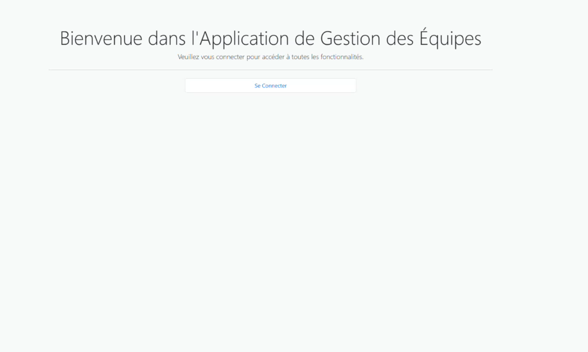

### Sign In
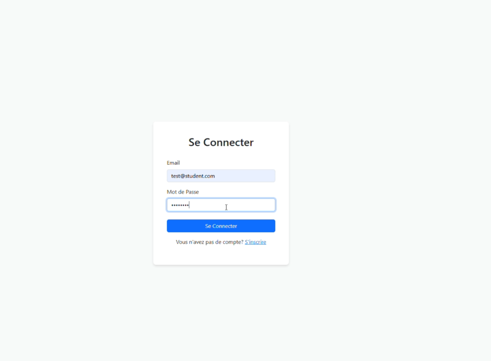

### Sign Up
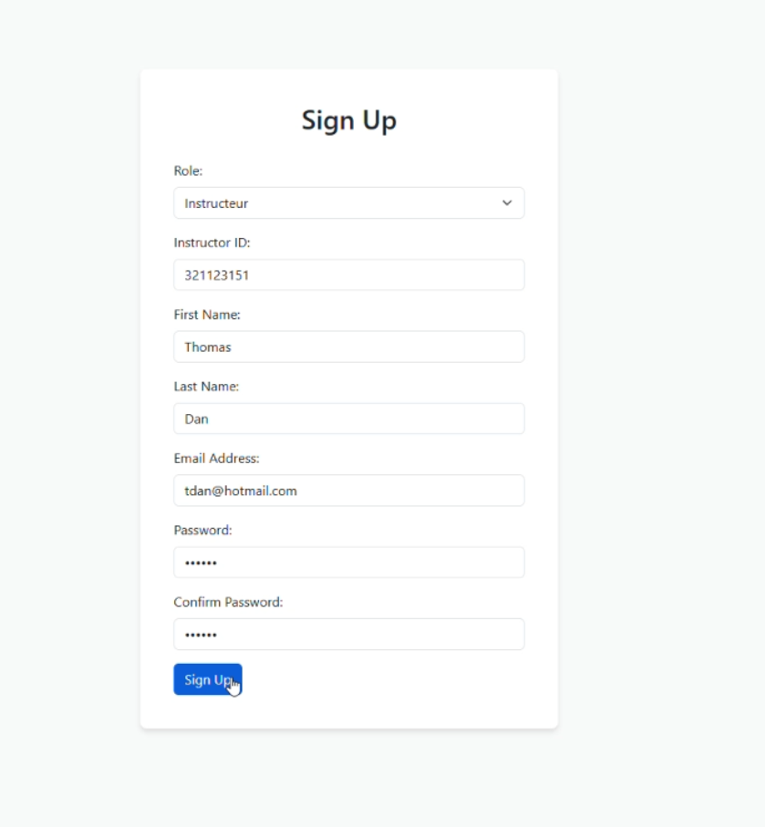

### Instructor Home
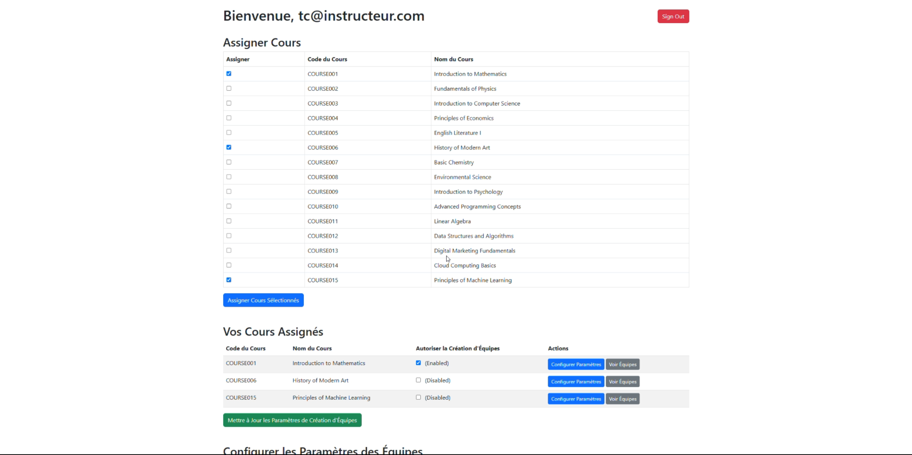

### Student Home
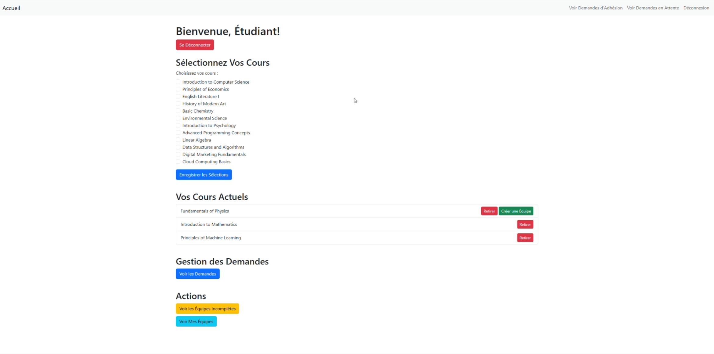

### Instructor: View Teams
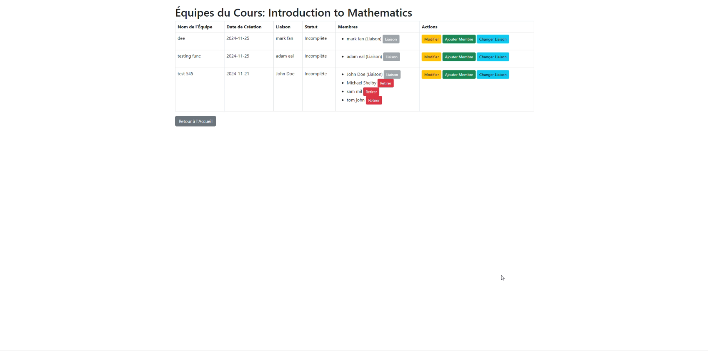

### View Teams
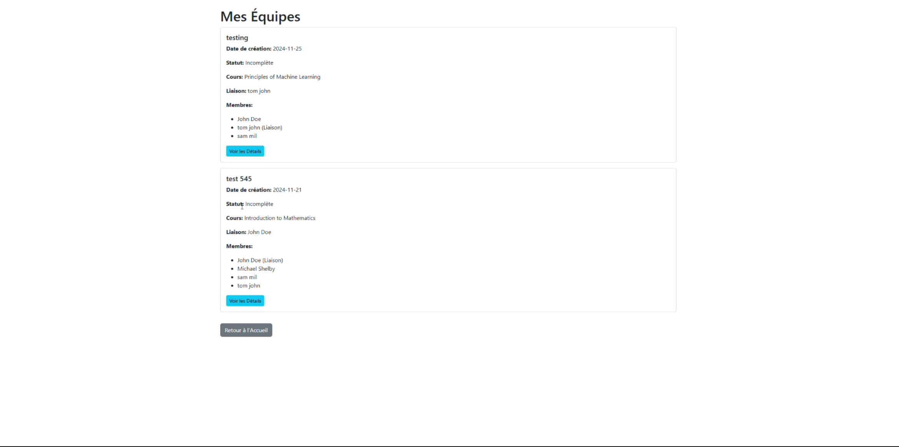

### Team Parameters
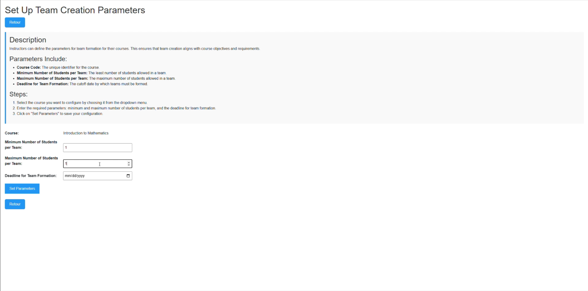

### Modify Team
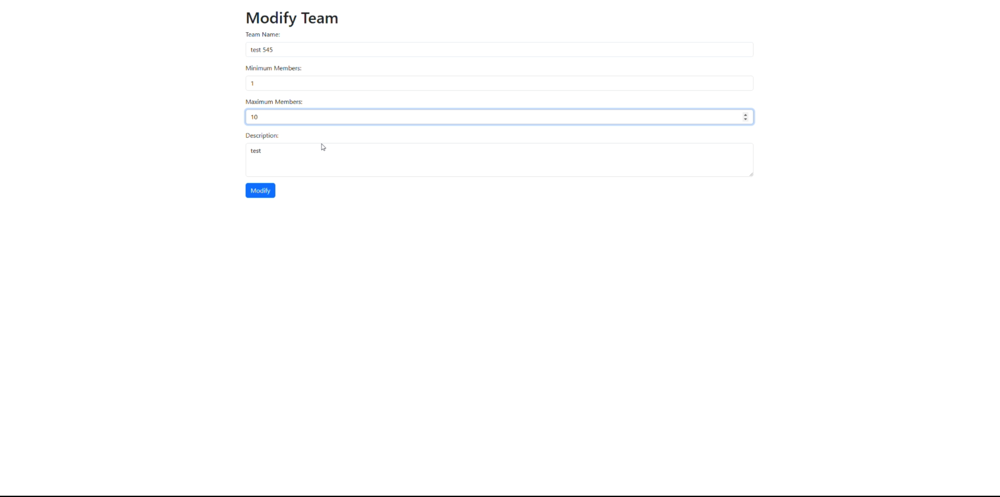

### Add Member
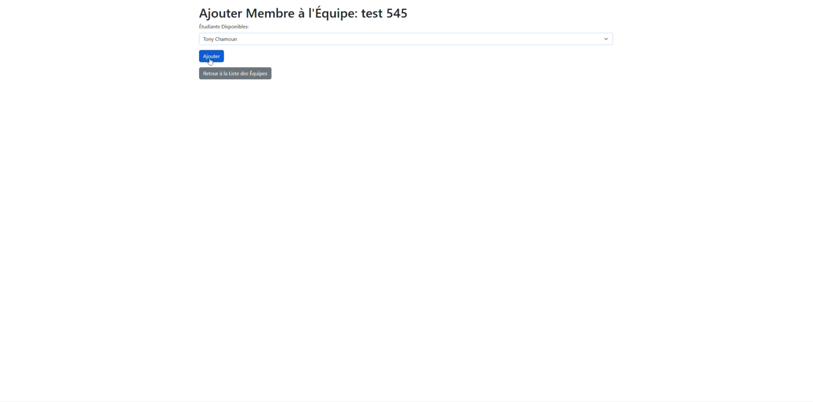

### Student Request
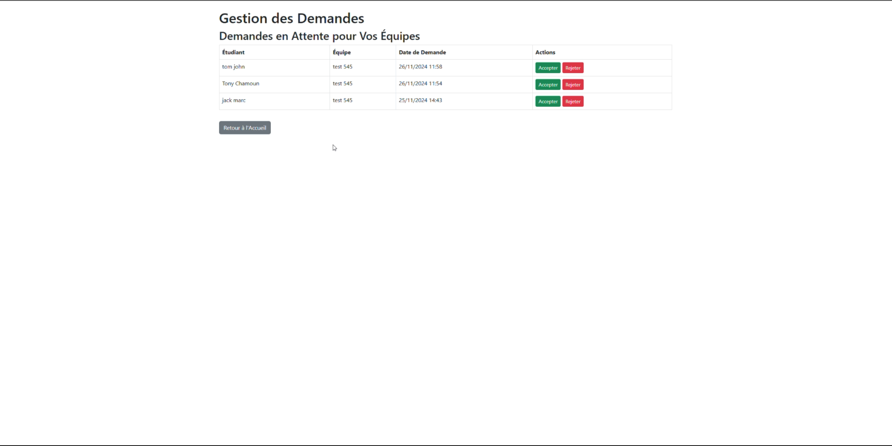

---

## Architecture (High-Level)

- **Thymeleaf UI** renders server-side pages via Spring MVC controllers  
- **Spring Security** enforces authentication + role authorization
- **Service layer** contains business rules (team creation, membership, requests)
- **PostgreSQL** stores users, teams, memberships, and join requests

---

## Purpose

This project was built to demonstrate:

- Full-stack development with Spring Boot + server-rendered UI
- Role-based authentication/authorization with Spring Security
- Persistent data modeling with PostgreSQL + JPA/Hibernate
- Deployment to production on Render
